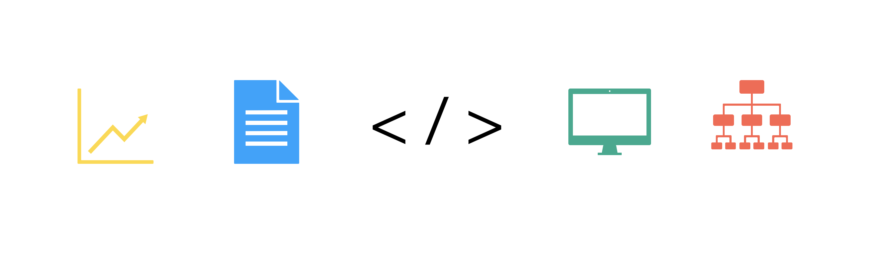

👋 ¡Hola! Soy Antonio Gonzalez

Full Stack Developer | Ingeniero en Tecnologías de la Información y Comunicaciones 

Bienvenido a mi perfil de GitHub.

Soy un Desarrollador Full Stack Senior con más de 5 años de experiencia diseñando, desarrollando e implementando soluciones de software para diferentes sectores, telecomunicaciones, consultoría y proyectos independientes.

Me apasiona crear aplicaciones escalables, automatizar procesos, resolver problemas complejos y documentar cada proyecto con un enfoque de ingeniería de software.

Actualmente estoy construyendo Psycrumb Technologies, mi marca profesional, donde concentro proyectos de desarrollo, automatización, arquitectura de software y documentación técnica de alto nivel.

    

⸻

🚀 Sobre mí

* 💻 Desarrollador Full Stack Senior
* 🎓 Ingeniero en Tecnologías de la Información y Comunicaciones
* ☕ Desarrollo Backend con Java, Python, JavaScript, HTML, PHP
* 🐍 Desarrollo y Automatización con Python
* 🌐 Desarrollo Frontend con Angular y React
* 🗄️ Diseño y administración de bases de datos SQL Server y MySQL, MongoDB, Oracle
* 🤖 Automatización mediante Selenium, Flask, Django, Jupyter
* 🔗 Desarrollo de APIs REST
* 📈 Mejora continua y aprendizaje constante
* 📍 México

⸻

🛠️ Tecnologías

Backend

* Java
* Spring Boot
* Python
* Flask
* PHP
* IntelliJ IDEA
* PHP

Frontend

* Angular
* React
* JavaScript
* HTML5
* CSS3
* Bootstrap

Bases de Datos

* SQL Server
* MySQL
* Oracle
* MongoDB

Herramientas

* Git
* GitHub
* Maven
* Selenium
* REST APIs
* Scrum
* Metodologías Ágiles

⸻

📂 ¿Qué encontrarás en este GitHub?

En este perfil publico proyectos relacionados con:

* 🚀 Desarrollo Full Stack
* ⚙️ Automatización de procesos
* 🌐 Aplicaciones Web
* 🔗 APIs REST
* 🤖 Automatización con Python y Selenium
* 📊 Arquitectura de Software
* 📚 Casos de estudio (Engineering Case Studies)
* 📖 Documentación técnica profesional

⸻

📘 Engineering Portfolio

Creo que un buen desarrollador no solo demuestra su experiencia mediante el código, sino también explicando el contexto, la arquitectura, las decisiones técnicas y el impacto de cada solución.

* Objetivos del proyecto
* Problema de negocio
* Arquitectura de la solución
* Tecnologías utilizadas
* Retos técnicos
* Soluciones implementadas
* Resultados obtenidos
* Lecciones aprendidas

Ademas, Estos proyectos incluye un Case Study con el análisis funcional, arquitectura, diagramas, decisiones técnicas, retos enfrentados y resultados obtenidos.

⸻

🎯 Actualmente

Actualmente estoy enfocado en:

* 📖 Documentar proyectos reales mediante casos de estudio.
* 💻 Publicar proyectos con documentación de nivel profesional.
* 📚 Continuar aprendiendo nuevas tecnologías y mejores prácticas de ingeniería.
* 🌐 Desarrollar un portafolio web profesional.

⸻

💡 Mi filosofía

“El software no solo debe funcionar; debe ser mantenible, escalable, bien documentado y aportar valor al negocio.”

⸻

¡Gracias por visitar mi perfil!

Si alguno de mis proyectos resulta de tu interés o deseas colaborar en una iniciativa tecnológica, será un gusto conectar contigo.
